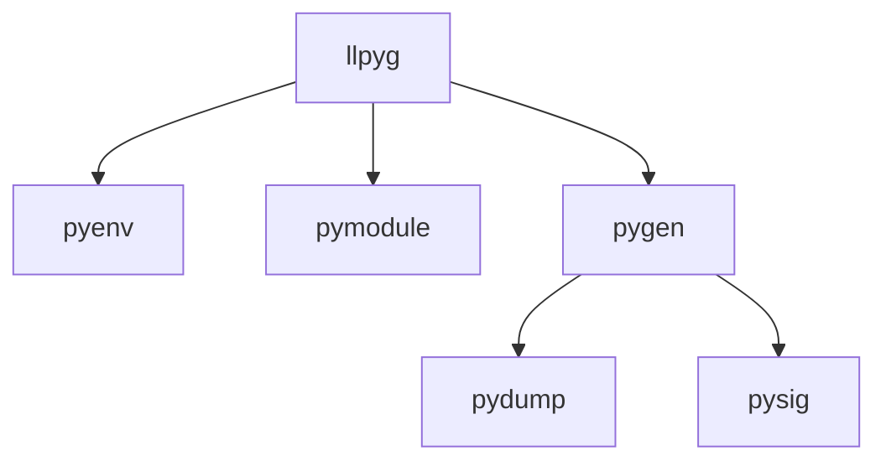

## Introduction

**[LLGo](https://github.com/goplus/llgo)**: A Go compiler based on LLVM, designed to better integrate with C and Python ecosystems.

**LLGo Bindings**: To enable Go code to call other languages, we need to map symbols from other languages to Go symbols, forming interfaces through which LLGo can invoke other languages. We call this one-to-one mapping interface LLGo Bindings, which represents the binding code for LLGo to other languages.

Taking Python's `numpy.add` function as an example:
```Python
numpy.add(x1, x2, /, out=None, *, where=True, casting='same_kind', order='K', dtype=None, subok=True[, signature, extobj])
```

The corresponding LLGo Bindings would be:
```Go
//go:linkname Add py.add
func Add(x1 *py.Object, x2 *py.Object) *py.Object
```

**[llpyg](https://github.com/goplus/llpyg)**: An automatic LLGo Bindings generation tool for Python packages.

## Product Design

### Target Users

llpyg targets users who need LLGo Bindings, specifically **LLGo developers**.

Based on this, llpyg can depend on LLGo, leveraging LLGo's Python ecosystem integration capabilities to conveniently extract symbol information from Python libraries. See details in [#5](https://github.com/goplus/llpyg/issues/5).

### Python Environment

llpyg uses the system Python or user-specified Python by default, and does not provide Python installation or automatic third-party library download services. See details in [#2](https://github.com/goplus/llpyg/issues/2#issuecomment-3200109475).

Users can specify the Python path through the `PYTHONHOME` environment variable. llpyg will not provide a separate environment variable. See details in [#9](https://github.com/goplus/llpyg/issues/9).

```bash
export PYTHONHOME=/path/to/python
```

llpyg uses the versions of Python libraries already installed by the user. If users want to convert different versions of Python libraries, they need to manually change the installed library versions or specify the location of the corresponding version library through the `PYTHONPATH` environment variable. See details in [#8](https://github.com/goplus/llpyg/issues/8).

```bash
export PYTHONPATH=/path/to/package
```

### Implemented Features

The main functionality implemented by llpyg is converting Python libraries to LLGo Bindings code. The converted symbol information includes constants, functions, classes, and methods.

For constants, the unified type is `*py.Object`.
```go
//go:linkname Pi py.pi
var Pi *py.Object
```

For functions, the unified return type is `*py.Object`.
```go
//go:linkname Add py.add
func Add(x1 *py.Object, x2 *py.Object) *py.Object
```

For classes and methods, they are converted to Go structs and methods. See details in [#14](https://github.com/goplus/llpyg/issues/14)
```go
type Animal struct {
	py.Object
}

//llgo:link (*Animal).Speak py.Animal.speak
func (a *Animal) Speak() *py.Object { return nil }
```

## Architecture Design

### Input and Output

llpyg takes Python library names as input, which can be standard libraries or third-party libraries. The output is LLGo Bindings code organized as Go modules.

Two forms of input are supported:
1. Command line parameters
2. Configuration files

**Command line parameter input**:
```bash
llpyg [-o output_dir] [-mod mod_name] [-d module_depth] py_lib_name
```

**Configuration file input**:
```bash
llpyg [-o output_dir] [-mod mod_name] llpyg.cfg
```

Parameter description:
- `-o`: Output directory, default value is `./test`
- `-mod`: Generated Go module name, default value is the Python library name
- `-d`: Maximum module depth to retrieve for Python libraries, default value is 1
- `py_lib_name`: Python library name
- `llpyg.cfg`: Configuration file path

Configuration file example:
```json
{
  "name": "numpy",
  "libName": "numpy",
  "modules": [
    "numpy"
  ]
}
```

**Program output**:
```text
numpy
├── numpy.go    // Main module LLGo Bindings file
├── random
│   └── random.go    // Submodule LLGo Bindings file
├── go.mod
├── go.sum
└── llpyg.cfg    // Configuration file
```

### Project Structure
```text
llpyg
├── _xtool
│   ├── pydump
│   └── pymodule
├── cmd
│   └── llpyg
├── doc
├── tool
│   ├── pyenv
│   ├── pygen
│   └── pysig
├── go.mod
├── go.sum
├── install.sh
├── README.md
└── LICENSE
```

- `_xtool`: Sub-components that need to be compiled and installed using LLGo
- `cmd`: llpyg executable file
- `tool`: Sub-components that do not depend on LLGo
- `doc`: Project documentation

### Module Division

This project includes the following modules:
- **llpyg**: Project entry program, responsible for parsing input parameters and calling other modules
- **pymodule**: Gets multi-level module names of Python libraries, used for generating configuration files
- **pydump**: Gets symbol information from Python libraries, including constants, functions, classes, and methods
- **pyenv**: Sets Python dynamic library paths and performs environment checks
- **pysig**: Parses function and method signatures
- **pygen**: Generates LLGo Bindings code using gogen based on symbol information

The calling relationships between modules are shown in the diagram:


## Module Interfaces

### pymodule
> /_xtool/pymodule/pymodule.go

This module is responsible for parsing multi-level module names of Python libraries and third-party library version numbers, with results used to generate llpyg.cfg configuration files.

Interface input:
```bash
pymodule [-d <depth>] <py_lib>
```

Parameter description:
- `-d`: Maximum module depth to retrieve for Python libraries, default value is 1
- `<py_lib>`: Python library name

Return value:
```go
type library struct {
	LibName 	string 		`json:"libName"`
	LibVersion  string 		`json:"libVersion"`
	Depth 		int  		`json:"depth"`
	Modules 	[]string 	`json:"modules"`
}
```

### pydump
> /_xtool/pydump/pydump.go

This module is responsible for getting symbol information from Python libraries. The Python objects obtained include constants, functions, classes, and methods. For each Python object, the information obtained includes name, type, documentation, and signature.

Interface input:
```bash
pydump <moduleName>
```

Parameter description:
- `<moduleName>`: Python module name to parse

Return value:
```go
type symbol struct {
	Name string `json:"name"`
	Type string `json:"type"`
	Doc  string `json:"doc"`
	Sig  string `json:"sig"`
}

type module struct {
	Name  string    `json:"name"`
	Items []*symbol `json:"items"`
}
```

### pysig
> /tool/pysig/parse.go

This module is responsible for parsing signature strings and returning parameter information.

Interface function:
```go
func Parse(sig string) (args []*Arg)
```

Return value is a parameter list:
```go
type Arg struct {
	Name     string `json:"name"`
	Type     string `json:"type"`
	DefVal   string `json:"defVal"`
	Optional bool   `json:"optional"`
}
```

### pygen
> /tool/pygen/pygen.go

This module is responsible for calling pydump and pysig, and generating LLGo Bindings code based on symbol information.

Interface function:
```go
func GenLLGoBindings(moduleName string, outFile io.Writer)
```

Parameter description:
- `moduleName`: Python module name
- `outFile`: Output file for writing LLGo Bindings code

Output example:
```go
package animals

import (
	"github.com/goplus/lib/py"
	_ "unsafe"
)

const LLGoPackage = "py.animals"

//go:linkname Speak py.speak
func Speak(msg *py.Object) *py.Object
```

